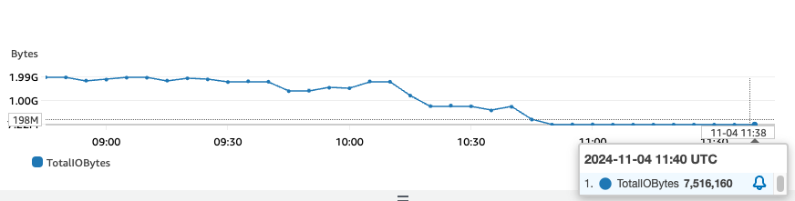

# NFS Getattr Cache

## Description & Motivation

This is a simple kernel module that implements a cache for NFS getattr calls. We built this after noticing high metadata requests on EFS. These requests were due to the application reading the same directory over and over again, continuously waiting for new files to be created. Since we couldn't change the application code, we implemented a cache in the kernel to reduce the metadata requests by 99,73%.

## Results



The graph shows the reduction in metadata requests after implementing the cache. The blue line represents metadata throughput (sum of IO bytes per 15 minutes). We achieved a 99.73% reduction in metadata requests by caching getattr calls for 1 second.


## Prerequisites

* Linux kernel headers (linux-headers-$(uname -r))
* Linux kernel development tools (kernel-devel-$(uname -r))
* GCC (gcc)
* Make (make)

## Configuration

The module is configured to cache the attributes of the following paths:

```c
static const char *cached_paths[] = {
```

You can modify the `cached_paths` array to add or remove paths from the cache.

The `CACHE_TIMEOUT_MS` constant defines the cache timeout (TTL) in milliseconds.

The `CLEANUP_INTERVAL_MS` constant defines the cleanup interval in milliseconds.

The `MAX_PATH_LEN` constant defines the maximum path length.

## Build

```bash
make
```

## Install

```bash
sudo insmod nfsgetattrcache.ko
```

## Uninstall

```bash
sudo rmmod nfsgetattrcache
```
